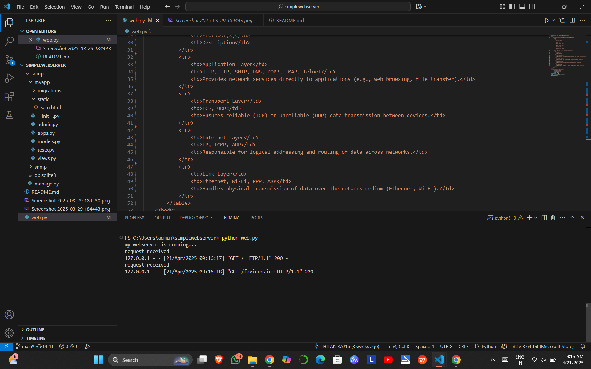

# EX01 Developing a Simple Webserver
## Date:21/04/2025

## AIM:
To develop a simple webserver to serve html pages and display the list of protocols in TCP/IP Protocol Suite.

## DESIGN STEPS:
### Step 1: 
HTML content creation.

### Step 2:
Design of webserver workflow.

### Step 3:
Implementation using Python code.

### Step 4:
Import the necessary modules.

### Step 5:
Define a custom request handler.

### Step 6:
Start an HTTP server on a specific port.

### Step 7:
Run the Python script to serve web pages.

### Step 8:
Serve the HTML pages.

### Step 9:
Start the server script and check for errors.

### Step 10:
Open a browser and navigate to http://127.0.0.1:8000 (or the assigned port).

## PROGRAM:
```
from http.server import HTTPServer, BaseHTTPRequestHandler
content = """
<html>
    <title>List of protocols in TCP/IP Protocol Suite-212224040353</title>
    <body>
        <style>
            body {
                font-family: Arial;
                text-align: center;
            }
            table {
                margin: auto; 
                border-collapse: collapse;
                border: 1px solid black;
            }
            th, td {
                border: 1px solid black;
                padding: 10px;
                text-align: left;
            }
            th {
                background-color: #f2f2f2;
            }
        </style>
        <h1>List of protocols in TCP/IP Protocol Suite-212224040353</h1>
        <table>
            <tr>
                <th>Layer</th>
                <th>Protocol(s)</th>
                <th>Description</th>
            </tr>
            <tr>
                <td>Application Layer</td>
                <td>HTTP, FTP, SMTP, DNS, POP3, IMAP, Telnet</td>
                <td>Provides network services directly to applications (e.g., web browsing, file transfer).</td>
            </tr>
            <tr>
                <td>Transport Layer</td>
                <td>TCP, UDP</td>
                <td>Ensures reliable (TCP) or unreliable (UDP) data transmission between devices.</td>
            </tr>
            <tr>
                <td>Internet Layer</td>
                <td>IP, ICMP, ARP</td>
                <td>Responsible for logical addressing and routing of data across networks.</td>
            </tr>
            <tr>
                <td>Link Layer</td>
                <td>Ethernet, Wi-Fi, PPP, ARP</td>
                <td>Handles physical transmission of data over the network medium (Ethernet, Wi-Fi).</td>
            </tr>
        </table>
    </body>
</html>
"""
class myhandler(BaseHTTPRequestHandler):
    def do_GET(self):
        print("request received")
        self.send_response(200)
        self.send_header('content-type', 'text/html; charset=utf-8')
        self.end_headers()
        self.wfile.write(content.encode())
server_address = ('',8000)
httpd = HTTPServer(server_address,myhandler)
print("my webserver is running...")
httpd.serve_forever()
```

## OUTPUT:


## RESULT:
The program for implementing simple webserver is executed successfully.
